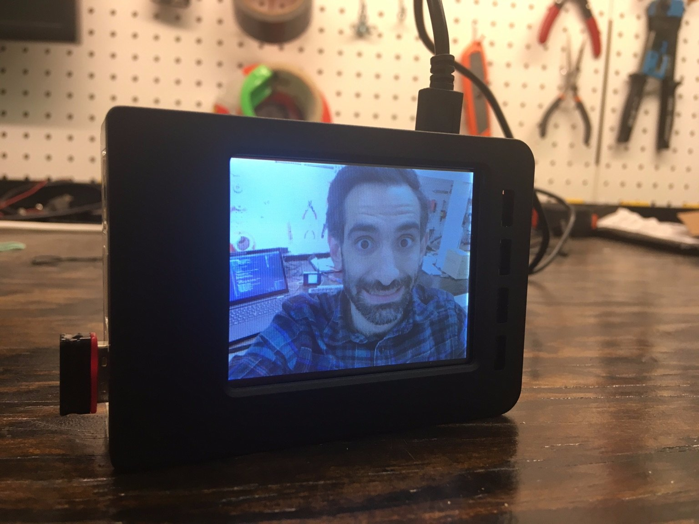

# rpi_slideshow

raspberry pi picture frame that creates a slide-show from images in google drive. This repo includes [gdrive_frame](https://github.com/brizandrew/gdrive_frame) as a [submodule](https://blog.github.com/2016-02-01-working-with-submodules/). Below are instructions for setting up a raspberry pi for use w/this repo.



# Hardware requirements
this has been tested to work w/the following hardware (but obviously, slight variations should work... i imagine):
- 8GB - 32GB MicroSD Card
- [Raspberry Pi 3](https://www.adafruit.com/product/3055)
- [Raspberry Pi 3 Power Adapter](https://www.adafruit.com/product/1995)
- [PiTFT 320x240 2.8" Resistive Touchscreen](https://www.adafruit.com/product/2298)
- ~~[USB WiFi Dongle](https://www.amazon.com/gp/product/B018LHT6R6/ref=oh_aui_detailpage_o00_s00?ie=UTF8&psc=1)~~ (turns out the Pi 3's got built in WiFi)
- [Case Base and Faceplate Pack](https://www.adafruit.com/product/3062) (optional)

# raspberry pi setup

### Write Raspbian Image to SD card
[download raspbian](https://www.raspberrypi.org/downloads/raspbian/) (i went with
"Raspbian Stretch with desktop"). b/c i'm on Ubuntu i just used the easy-peasy [Startup Disk Creator](https://tutorials.ubuntu.com/tutorial/tutorial-create-a-usb-stick-on-ubuntu#0) to get it on a card, but other instructions can be found [on the raspberry pi site](https://www.raspberrypi.org/documentation/installation/installing-images/README.md)

keep in mind u'll need not only a keyboard/mouse but also a screen u can plug into the PI's HDMI port (the little screen won't work until after the next step).

also make sure u've got the WiFi dongle plugged in. when u boot up the Pi for the first time it'll run u through a welcome wizard (this will include setting up the WiFi if the dongle is in). This process will end by asking u to reboot, **NOTE:** for me the WiFi doesn't work until after this initial reboot.

### Run PiTFT install script
As documented in the [adafruit tutorial](https://learn.adafruit.com/adafruit-pitft-28-inch-resistive-touchscreen-display-raspberry-pi/easy-install-2) in order to get the PiTFT screen working u've got to run the following:
```
cd ~
wget https://raw.githubusercontent.com/adafruit/Raspberry-Pi-Installer-Scripts/master/adafruit-pitft.sh
chmod +x adafruit-pitft.sh
sudo ./adafruit-pitft.sh
```
then just follow the instructions:
- choose '1' for 'select configuration' (assuming u've got the screen mentioned above)
- choose '1' again for rotation
- when it asks 'Would you like the console to appear on the PiTFT display' say no
- when it asks 'Would you like the HDMI display to mirror to the PiTFT display?' i'd say yes to dev on a second monitor (that tiny 2.8" screen's not the best for deving)
- reboot (or finish the rest of the steps first, which i'd recommend)

### Install latest NodeJS/NPM

assuming 11 is the latest, run:
```
curl -sL https://deb.nodesource.com/setup_11.x | sudo -E bash -
```
then
```
sudo apt install -y nodejs
```

### clone this repo

b/c there's a submodule make sure to use `--recursive` when cloning:
```
git clone --recursive https://github.com/nbriz/rpi_slideshow.git
```
then cd into the gdrive_frame submodule && install the dependencies
```
cd rpi_slideshow/gdrive_frame
npm install --only=prod
```
then as per the gdrive_frame [README instructions](https://github.com/brizandrew/gdrive_frame), copy the .env template && edit to include ur credz:
```
cp .env.template .env
```
then install the root project's dependencies
```
cd ../
npm install
```
then test it all out by running. if u currently have chromium open (say b/c u're following this tutorial) it won't launch in kiosk mode. u'll have to quit chromium before running the server to see it launch in kiosk mode.
```
node server
```
then alt-tab ur way back to the terminal to `cntrl+c` the process. (or click the quit-app button in the GUI)

### setup pm2 service

check out pm2's [quick start](http://pm2.keymetrics.io/docs/usage/quick-start/) guide for more details on pm2, but the gist is:

install pm2
```
sudo npm install -g pm2
```
then, assuming ur in the rpi_slideshow directory, create the service
```
pm2 start server.js
```
u can stop the service at any time by running:
```
pm2 stop server
```
then make sure pm2 itself starts on startup, if u run `pm2 startup` it will tell u to run:
```
sudo env PATH=$PATH:/usr/bin /usr/lib/node_modules/pm2/bin/pm2 startup systemd -u pi --hp /home/pi
```

### prevent screen blanking

by default the screen will go blank after about 10 mins of no user input. u can just tap the screen to bring it back, but that kind of kills the whole digital picture frame vibe. so to disable this run `sudo nano /etc/lightdm/lightdm.conf`, scroll to the bottom and include in that file the following:
```
[SeatDefaults]
xserver-command=X -s 0 -dpms
```

### install TeamViewer

for remote access i installed [TeamViewer's Host for Raspberry Pi](https://www.teamviewer.com/en/download/linux/). u'll need to have created a TeamViewer account beforehand in order to grant u're account "easy access" to the Pi

# debugging

when run via `node server` (or `node server dev` to avoid kiosk mode), rather than `pm2 start server`, u'll have access to lots of logging in the terminal. so if/when we need to debug the app it should be launched that way.
